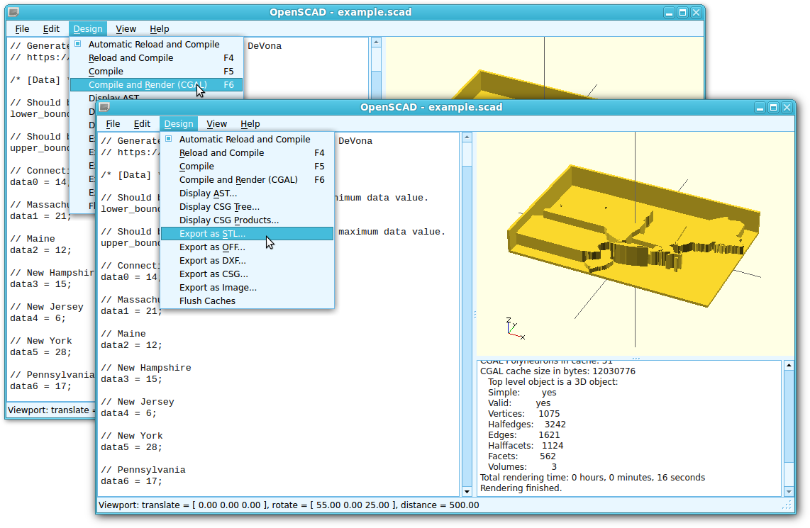
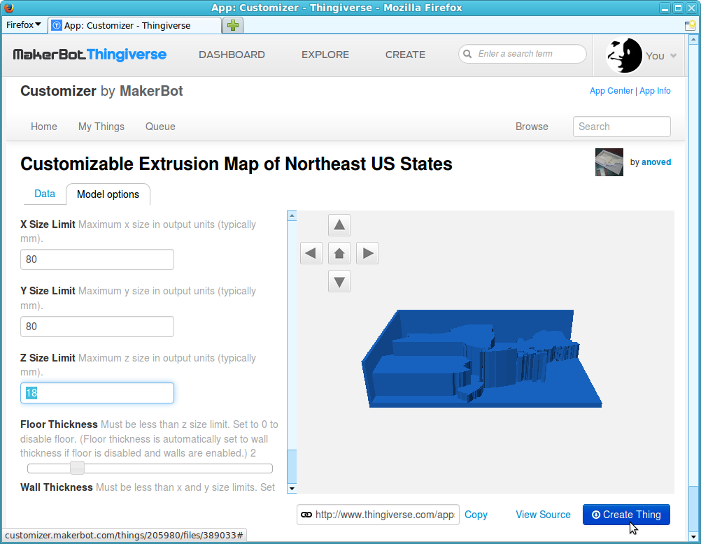

# Prismap

This script generates an [OpenSCAD](http://www.openscad.org/) model of a polygon shapefile with features extruded proportional to designated attribute values. Using OpenSCAD, the extruded "prism map" can be exported to STL format suitable for 3D printing. Prismap's OpenSCAD output is also compatible with [MakerBot Thingiverse Customizer](http://www.thingiverse.com/apps/customizer), meaning the models can be modified using the web interface provided by Customizer. This allows other people to easily remix Prismap map templates with their own data.

## Example

The model displayed above was generated with the following options:

	./prismap.tcl                   \
	    --in examples/northeast.shp \
	    --out examples/example.scad \
	    --attribute Measure         \
	    --names name                \
	    --lower 0 --upper 30        \
	    --floor 1 --walls 1         \
	    -x 80 -y 80 -z 10 

Note that this example includes disconnected "island" features which may be too small to print successfully. Some prep work to prune unnecessary detail will typically be needed to prepare shapefiles for printing.

## Usage

Here is the output of `prismap --help`:

	Usage: prismap OPTIONS
	
	Prismap generates an OpenSCAD script representing the polygon features of the
	input shapefile extruded proportional to the values of a named attribute field.
	The OpenSCAD output is compatible with Makerbot Thingiverse Customizer.
	
	Preprocessing is advisable to prepare shapefiles for conversion with Prismap.
	Small holes or islands should be pruned and complex boundaries shoulds be
	simplified. Feature coordinates are retained without modification. If your
	shapefile's coordinate system is not suited for Cartesian display, consider
	working with a reprojected version instead.
	
	REQUIRED OPTIONS:
	
	-i/--in PATH
	    Read input shapefile from PATH. PATH may identify any basic shapefile part
	    (.shp, .shx, or .dbf) or the base name (minus suffix), but all three parts
	    must be present. Only xy polygon shapefiles are supported.
	
	-o/--out PATH
		Write OpenSCAD script to file at PATH. If PATH is a single hyphen character
		("-"), the script is written to standard output.
	
	ATTRIBUTE OPTIONS:
	
	Features are extruded according to their attribute value.
	
	-d/--default VALUE
		Set the default attribute value. Default values are used if no --attribute
		field is specified or in place of any null attribute values encountered.
		The default VALUE is 0.
	
	-a/--attribute FIELD
		Read attribute values from the named FIELD. The attribute field type must
		be numeric (integer or double).
	
	-n/--names FIELD
		Label attribute value definitions in the output OpenSCAD script using names
		read from the named FIELD.
	
	Use these options to explicitly set fixed bounds for the extrusion. This is
	useful to ensure that multiple models (representing a time series, for example)
	are output at the same scale and are therefore comparable.
	
	-l/--lower VALUE
		Set the lower bound of the extrusion - the "floor" height. The default
		VALUE is the minimum value of the attribute.
	
	-u/--upper VALUE
		Set the upper bound of the extrusion - the "ceiling" height. The default
		VALUE is the maximum value of the attribute.
	
	OUTPUT SIZE OPTIONS:
	
	Use these options to constrain the size of the output model. Size values
	are in output units, typically interpreted to be millimeters.
	
	-x VALUE
		Features will be scaled to largest size that fits within VALUE output
		units in the X dimension. Defaults to actual X extent of input features.
	
	-y VALUE
		Features will be scaled to largest size that fits within VALUE output
		units in the Y dimension. Defaults to actual Y extent of input features.
	
	-z VALUE
		Extrusion will be scaled so the --upper value would not exceed VALUE
		output units in the Z dimension. Defaults to smaller of X and Y limit. 
	
	MODEL OPTIONS:
	
	-f/--floor THICKNESS
		Include a floor layer with THICKNESS in output units. The floor layer is
		useful for connecting discontiguous features. The floor is automatically
		enabled if --walls are enabled (wall thickness is used if floor not set).
	
	-w/--walls THICKNESS
		Include walls on two sides of the model, with THICKNESS in output units. 
		Wall THICKNESS must be greater than or equal to 0.1. Default is 1.0. The
		walls are located adjacent to the -x and +y sides of the bounding box and
		extend to the extrusion ceiling (see --upper).
	
	MISCELLANEOUS OPTIONS:
	
	--debug
		Print configuration values and shapefile info to standard error.
	
	--help
		Display this usage message.

## Converting Prismap's Output to Printable STL

Prismap outputs an [OpenSCAD](http://www.openscad.org/) script. To convert it to a printable STL model, choose *"Compile and Render"* followed by *"Export as STL"* from OpenSCAD's *"Design"* menu.

Alternatively, you can convert the model on the command line. Use OpenSCAD's `-o` option to specify the output STL file:

	openscad -o example.stl example.scad

Last but not least, you can upload the OpenSCAD model to [Thingiverse](http://www.thingiverse.com/thing:205980). If you tag the model with `customizer`, Thingiverse will allow you (and others) to customize the model online. Clicking *"Create Thing"* will save a printable STL version of customized model to your Thingiverse account.

Use Prismap to generate printable map templates, then share them on Thingiverse in this way to let other people easily remix them with their own data.

## Prerequisites

- [Shapetcl](https://github.com/anoved/Shapetcl/) (build `shapetcl.so` and install in your Tcl `auto_path` with `make && make install`)

## License

Prismap is freely distributed under an open source MIT License:

> Copyright (c) 2013 Jim DeVona
> 
> Permission is hereby granted, free of charge, to any person obtaining a copy of
> this software and associated documentation files (the "Software"), to deal in
> the Software without restriction, including without limitation the rights to
> use, copy, modify, merge, publish, distribute, sublicense, and/or sell copies of
> the Software, and to permit persons to whom the Software is furnished to do so,
> subject to the following conditions:
> 
> The above copyright notice and this permission notice shall be included in all
> copies or substantial portions of the Software.
> 
> THE SOFTWARE IS PROVIDED "AS IS", WITHOUT WARRANTY OF ANY KIND, EXPRESS OR
> IMPLIED, INCLUDING BUT NOT LIMITED TO THE WARRANTIES OF MERCHANTABILITY, FITNESS
> FOR A PARTICULAR PURPOSE AND NONINFRINGEMENT. IN NO EVENT SHALL THE AUTHORS OR
> COPYRIGHT HOLDERS BE LIABLE FOR ANY CLAIM, DAMAGES OR OTHER LIABILITY, WHETHER
> IN AN ACTION OF CONTRACT, TORT OR OTHERWISE, ARISING FROM, OUT OF OR IN
> CONNECTION WITH THE SOFTWARE OR THE USE OR OTHER DEALINGS IN THE SOFTWARE.

