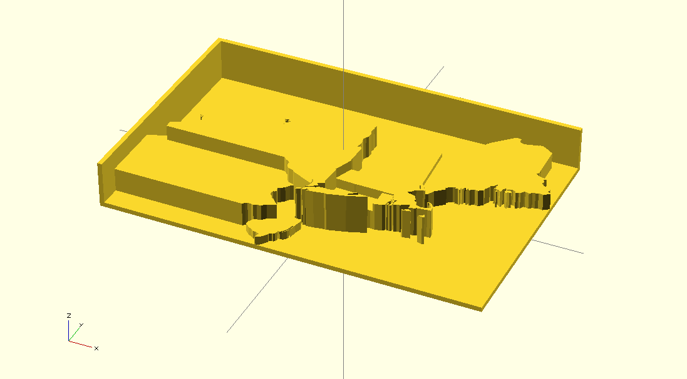

# Prismap

This script generates an [OpenSCAD](http://www.openscad.org/) model of a polygon shapefile with features extruded proportional to designated attribute values. Using OpenSCAD, the extruded "prism map" can be exported to STL format suitable for 3D printing. It is a work in progress.

The end goal is to generate prism map templates configurable with [MakerBot Thingiverse Customizer](http://www.thingiverse.com/apps/customizer).

## Example

The model display above was generated with the following options:

	./prismap.tcl                   \
	    --in examples/northeast.shp \
	    --attribute Measure         \
	    --out examples/example.scad \
	    --height 5                  \
	    --base 0.1                  \
	    --floor                     \
	    --lower 0                   \
	    --upper 30

Note that this example includes disconnected "island" features which may be too small to print successfully. Some prep work to prune unnecessary detail will typically be needed to prepare shapefiles for printing.

## Usage

Here is the output of `prismap --help`:

	Usage: prismap OPTIONS
	
	Prismap generates an OpenSCAD script representing the polygon features of the
	input shapefile extruded proportional to the values of a named attribute field.
	The intent is to produce tangible 3D printable models of the conceptual data
	model beneath choropleth thematic map design - the "prism map".
	
	Preprocessing is advisable to prepare shapefiles for conversion with Prismap.
	For printing purposes, all features should comprise a contiguous region. Small
	holes or islands should be pruned and complex boundaries shoulds be simplified.
	
	Feature coordinates are retained without modification. If your shapefile's
	coordinate system is not suited for Cartesian display, consider working with a
	reprojected version instead. (You can rescale OpenSCAD output before printing.)
	
	REQUIRED OPTIONS:
	
	-i/--in PATH
		Read input shapefile from PATH. PATH may identify any basic shapefile part
		(.shp, .shx, or .dbf) or the base name (minus suffix), but all three parts
		must be present. Only xy polygon shapefiles are supported.
	
	-a/--attribute NAME
	-d/--default VALUE
		Extrude shapefile features according to the value of the attribute field
		NAME or, if NAME is not specified, the constant default VALUE. At least one
		of these options must be specified. If both are specified, the default
		value will be used only where there attribute field value is null.
		The attribute field type must be numeric (integer or double).
	
	-o/--out PATH
		Write OpenSCAD script to file at PATH. If PATH is a single hyphen character
		("-"), the script is written to standard output.
	
	DATA RANGE OPTIONS:
	
	Use these options to explicitly set fixed bounds for the extrusion. This is
	useful to ensure that multiple models (representing a time series, for example)
	are output at the same scale and are therefore comparable.
	
	-l/--lower VALUE
		Set the lower bound of the extrusion - the "floor" height. VALUE must be
		less than or equal to the minimum value of the attribute. The default
		VALUE is the minimum value of the attribute.
	
	-u/--upper VALUE
		Set the upper bound of the extrusion - the "ceiling" height. VALUE must be
		greater than or equal to the maximum value of the attribute. The default
		VALUE is the maximum value of the attribute.
	
	SCALING OPTIONS:
	
	-s/--scale FACTOR
		Scaling FACTOR multiplied by attribute values to determine feature height
		in output units. FACTOR must be greater than zero. Default FACTOR is 1.0.
	
	-h/--height VALUE
		Explicitly set the height of the extrusion ceiling (see --upper) in output
		units. VALUE must be greater than zero. Overrides and recalculates --scale.
	
	-x/--xsize VALUE
		Bounding box will be scaled to largest size that fits within VALUE output
		units in the X dimension. If --ysize is also given, both constraints apply.
	
	-y/--ysize VALUE
		Bounding box will be scaled to largest size that fits within VALUE output
		units in the Y dimension. If --xsize is also given, both constraints apply. 
	
	MODEL OPTIONS:
	
	-b/--base THICKNESS
		Set the THICKNESS in output units of the base layer. A base layer is always
		present. THICKNESS must be greater than or equal to 0.1. Default is 1.0.
	
	-f/--floor
		Expand the base layer to fill the rectangular bounding box of the features.
	
	-w/--walls THICKNESS
		Include walls on two sides of the model, with THICKNESS in output unit. 
		Wall THICKNESS must be greater than or equal to 0.1. Default is 1.0. The
		walls are located adjacent to the -x and +y sides of the bounding box and
		extend to the extrusion ceiling (see --upper).
	
	MISCELLANEOUS OPTIONS:
	
	--debug
		Print configuration values and shapefile info to standard error.
	
	--help
		Display this usage message.

## Prerequisites

- [Shapetcl](https://github.com/anoved/Shapetcl/) (build `shapetcl.so` and install in your Tcl `auto_path` with `make && make install`)

## License

Prismap is freely distributed under an open source MIT License:

> Copyright (c) 2013 Jim DeVona
> 
> Permission is hereby granted, free of charge, to any person obtaining a copy of
> this software and associated documentation files (the "Software"), to deal in
> the Software without restriction, including without limitation the rights to
> use, copy, modify, merge, publish, distribute, sublicense, and/or sell copies of
> the Software, and to permit persons to whom the Software is furnished to do so,
> subject to the following conditions:
> 
> The above copyright notice and this permission notice shall be included in all
> copies or substantial portions of the Software.
> 
> THE SOFTWARE IS PROVIDED "AS IS", WITHOUT WARRANTY OF ANY KIND, EXPRESS OR
> IMPLIED, INCLUDING BUT NOT LIMITED TO THE WARRANTIES OF MERCHANTABILITY, FITNESS
> FOR A PARTICULAR PURPOSE AND NONINFRINGEMENT. IN NO EVENT SHALL THE AUTHORS OR
> COPYRIGHT HOLDERS BE LIABLE FOR ANY CLAIM, DAMAGES OR OTHER LIABILITY, WHETHER
> IN AN ACTION OF CONTRACT, TORT OR OTHERWISE, ARISING FROM, OUT OF OR IN
> CONNECTION WITH THE SOFTWARE OR THE USE OR OTHER DEALINGS IN THE SOFTWARE.

